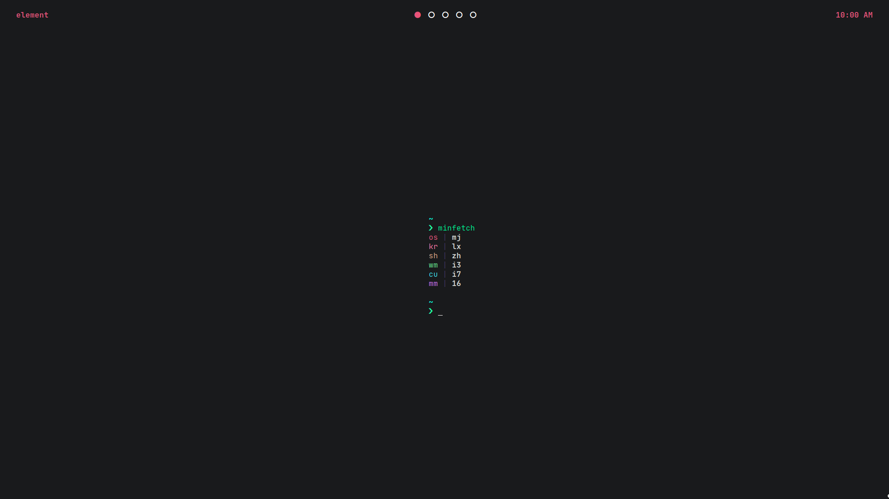

# dots

My dotfiles for Manjaro and i3

## Dependencies
 - yay
 - vim
 - go 1.15
 - i3-gaps
 - dunst
 - picom-ibhagwan-git
 - polybar
 - rofi
 - termite
 - ffmpeg
 - exa
 - git
 - scr
 - zsh autosuggestions & syntax
 - vim-plug
 - nerd-fonts-jetbrains-mono
 - hsetroot
 - pulseaudio (for pactl)
 - xob
 - shotgun
 - wmutils
 - xclip

## Programs
 - visual-studio-code-bin
 - jdk8-openjdk
 - jre8-openjdk
 - node (pnpm)
 - brave
 - starship.rs
