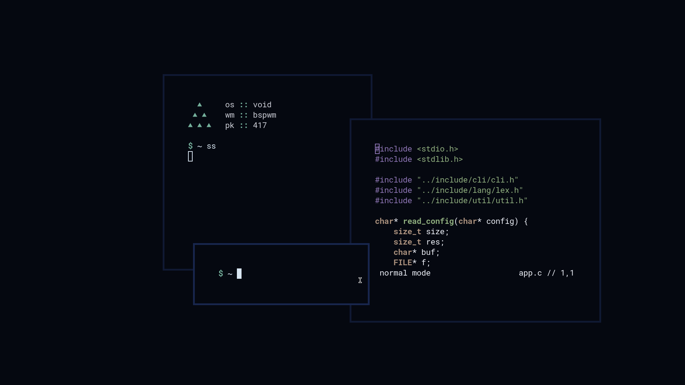

<h1 align="center">~ dots ~</h1>

### Details

Hey there! Here are some details about my current setup, codenamed `tropical`.

## Setup

> If you're looking for my [last setup](https://www.reddit.com/r/unixporn/comments/irhskz/i3_the_arctic/), codenamed `arctic`, click [here](https://github.com/safinsingh/dots/tree/e5b8775e6ed751c2300a5a7644fea176a39b6e4f).

- 🐧 **Distro**: [arch](https://www.archlinux.org/)
- ⌨️ **Terminal**: [alacritty](https://github.com/alacritty/alacritty)
- 🕹️ **WM**: [bspwm](https://github.com/baskerville/bspwm)
- 📃 **Editor**: [neovim](https://github.com/neovim/neovim)
- 🔍 **Menu**: [rofi](https://github.com/davatorium/rofi)
- 🐚 **Shell**: [bash](https://www.gnu.org/software/bash/)
- 🔤 **Font**: [uw ttyp0](https://people.mpi-inf.mpg.de/~uwe/misc/uw-ttyp0/)
- 📖 **Start page**: [custom](https://safinsingh.github.io/start)
