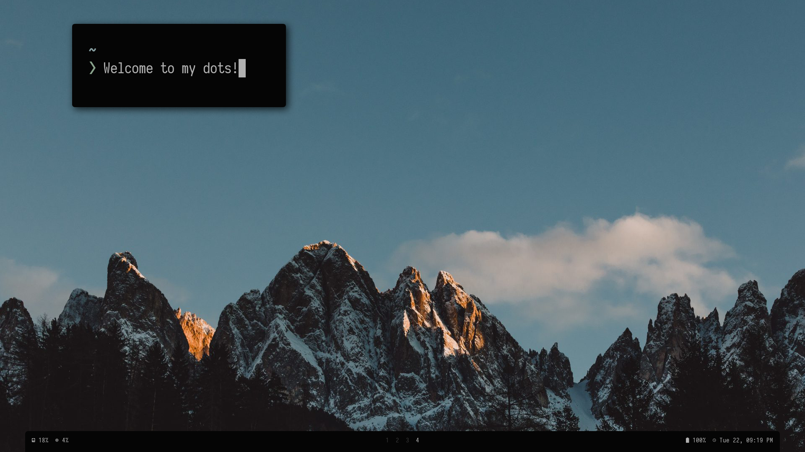
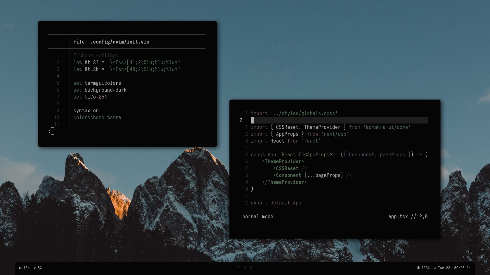

  

### Details

Hey there! Here are some details about my [current setup](https://www.reddit.com/r/unixporn/comments/irhskz/i3_the_arctic/), codenamed `arctic`:

- 🐧 **Distro**: Arch
- ⌨️ **Terminal**: [alacritty](https://github.com/alacritty/alacritty)
- 🕹️ **WM**: [i3-gaps](https://github.com/Airblader/i3)
- ⌛ **Bar**: [polybar](https://github.com/polybar/polybar)
- 📃 **Editor**: [neovim](https://github.com/neovim/neovim)
- 💾 **File browser**: [thunar](https://wiki.archlinux.org/index.php/Thunar)
- 🔍 **Menu**: [rofi](https://github.com/davatorium/rofi)

## Setup

