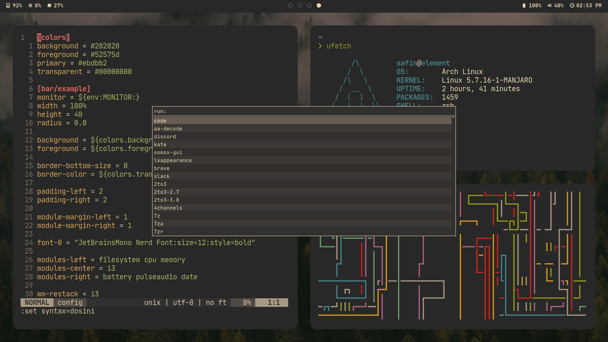

# dots

My [old] dotfiles for Manjaro and i3 (new dots for awesomea are in progress!)

## Dependencies

- yay
- vim
- go 1.15
- i3-gaps
- dunst
- polybar
- rofi
- alacritty
- ffmpeg
- exa
- git
- scr-git
- zsh autosuggestions & syntax
- vim-plug
- nerd-fonts-jetbrains-mono
- feh
- pulseaudio
- xob
- shotgun
- wmutils
- xclip

## Programs

- visual-studio-code-bin
- jdk-openjdk
- jre-openjdk
- node (pnpm)
- brave
- starship.rs
